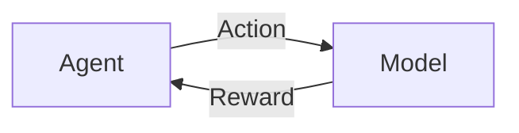

# Reinforcement Learning course 2 week 5

## TLDR

- Model , What is it?

## Model and why do we need it?

Before starting about model, let's think what kind of learning algorithms we have encountered till now.

In dynamic programming we have to know the model of the environment. That is the transition probabilities and the reward function. 

In the monte carlo method we do not need to know the model, but we need to wait till the end of the episode to update the value function. That is kind of knowing  the model because you are getting all the information at the end of the episode.

In TD learning method, we do not need to know the model, neither we need to wait till the end of the episode. We can update the value function at every time step and at random time step.

All of them have some of their own advantages and disadvantages.

How about we combine the advantages of the model-based and mondel-free methods?

## What is a model?

Let's define a model first.

Model is just a way of representing the environment. That is , for each state, and action to the environment, we should get the same reward and reward. Let's think about a video game of football match. Here are the players, the goal posts, the referees. The state and action - in this case- the ball  and player position, and the kick/ pass/ block , the reward will be similar , i.e. scording goals, blocking goals etc! But this is obvious from the example, you will not get the exact reward of scording goals!  in the same way, the model is representation of the environment. Not a "Replacement" of the environment. The purpose of this model is to get the simulated experience ( similar to the football game)  which will help your policy in the end!

## Types of Models

There are two types of models

- Sample models.
- Distribution models.

### Sample Models

What is a sample model? Let's put it this way, Suppose you have flipped multiple coins OR flipped same coin several times. Now you write down the heads and tails of those flipps. This is exactly SAMPLE MODEL! ***How about we write down the probabilities of each coins heads or tails?***

### Distribution model

Here comes the distribution model! If we know the probability distributions (or better, the functions) of the coin flips either one after the other or parallel flips we can get the distributions of each head or tail right?! This is Distribution model! 

### Sample Model vs Distribution Model

As we go forward ,we can realize the environemts to deal with, will be way complex to let distribution models deal with them! Think about [Atari Games](https://en.wikipedia.org/wiki/Atari_Games). How many states action and rewards are there! But if we want to use RL in real world - we need the sample based models!!

Think about this! Notice how many pausible outcomes for 12 dices ? But if we take the sample model approach, we can get the distribution (in other words, the outcomes of rolling 12 dices maybe 10000 times ), we still get some kind of working data with less computation and hassle.

The distribution model, which is getting the exact probability is useful when number of parameters are low (compared to the power of computation obviously!)

## PLanning using Q learning + Model

So, now we have idea about models, we have a very practical and interesting usecase. Suppose you have an accurate model for an environment. So, instead of letting agent interacting with the environment directly, how about we let the agent interact with the model ?!!

To be precise,

somehing like following happens

### Advantages of planning using model

The biggest advantage is that when you have a model, your reliance on training the agent based on interaction with the real world environment reduces drastically! Even if you train your model with the real environment, you can still train the agent using the model of the environment while you wait for the results from the actions to the real environment!

## Dyna Architecture

### Intuition
So, suppose , you are trying to learn how to score a goal in football (again!). You got the ball. You see the opposite team players. Try to dribble them. You may fail. You may not fail and pass them through! Everytime you fail to pass through them, you restart from the first position!  You do not get reward at each step you take! You will only get reward when you score the goal. Here is a problem with this approach.
It will take lots of games to make you learn (even if you can learn!)

*How about you do this!* At every step, you stop for a second, you strategize based on your past experiences and do whatever you think is the best? For first step, you may not have good information, but for 100th step, you might have more don't you? This thinking about the environment is modeling. The updating your strategy based on the goal you score or the lack thereof is the direct Reinforcement learning. We are basically combining the RL with planning !!! This is called Dyna Architecture.

## 2026/08/22

- [ ] Write about the video (https://www.coursera.org/learn/sample-based-learning-methods/lecture/k7Out/the-dyna-algorithm)

